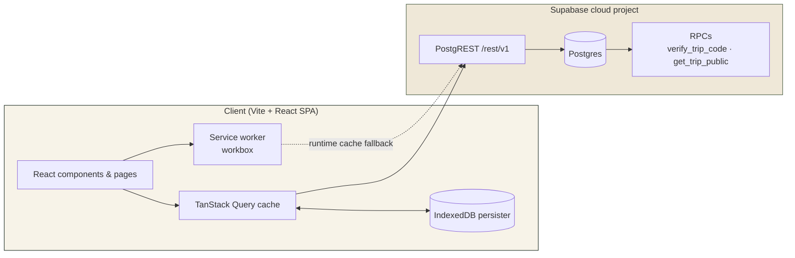

# Trailmark — Documentation

Trailmark is an offline-first trip planner + shared expense ledger for small group trips.
It installs as a PWA, works with no signal, and syncs automatically when a connection returns.

## Contents

| File | What it covers |
| --- | --- |
| [`master-prompt.md`](./master-prompt.md) | The original v3 build prompt, verbatim (source of truth for intent) |
| [`features.md`](./features.md) | Complete feature checklist, grouped by area, with done-status |
| [`ui-data-flow.md`](./ui-data-flow.md) | Routes, tabs, component tree, optimistic-write flow — with mermaid diagrams |
| [`data-model.md`](./data-model.md) | Postgres tables, RLS policies, RPCs, revision trigger — with ER diagram |
| [`usage.md`](./usage.md) | How to run, deploy, verify, and use the app (user + developer) |

## Architecture at a glance

## Core decisions (recap)

- **Read-only by default** — anyone with the `/t/<shortId>` link can view; a 4-digit code
  unlocks editing for that browser session (`sessionStorage`).
- **Per-member contribution model** — each member is either *even split* (unset) or has a
  *fixed contribution* target. The trip mixes both freely; there is no trip-wide toggle.
- **Per-expense splitting** — every entry splits evenly among a chosen subset (default
  everyone) or by exact amounts per member (summed validation). Independent of the
  contribution model.
- **Multi-payer entries** — one bill can list multiple payers with amounts that sum to the
  entry total.
- **Offline-first writes** — mutations run with `networkMode: 'offlineFirst'`, persist to
  IndexedDB, pause while offline, and resume in order when `navigator.onLine` returns.
- **Revision history** — a DB trigger snapshots each `ledger_entries` row before update;
  the UI shows an "edited" badge with the history.
