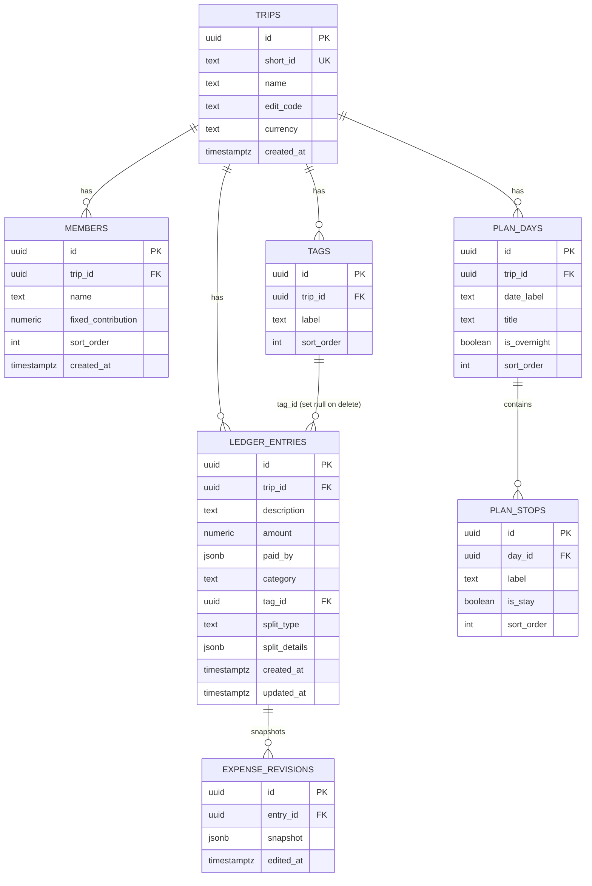
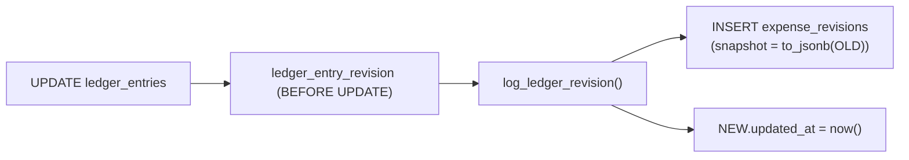
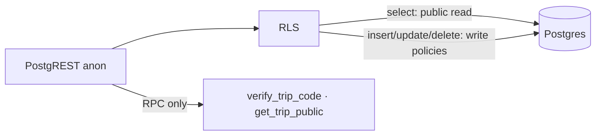
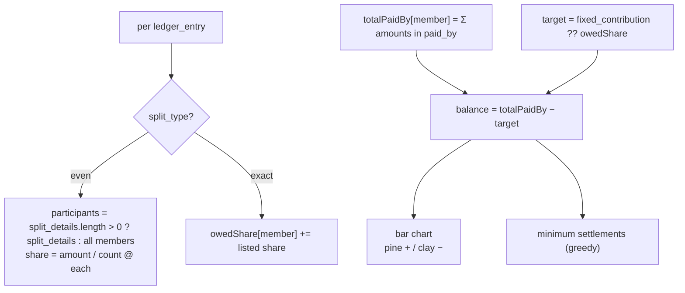

# Data Model

Postgres schema for the app, managed by `supabase/schema.sql`. Migration is idempotent
(drops existing objects first) and was applied to the Supabase cloud project.

## Entity-relationship diagram

## Column semantics

### `trips`

| Column | Notes |
| --- | --- |
| `short_id` | 6-char lowercase alphanumeric share code; unique; generated client-side, collision-checked on insert |
| `edit_code` | 4-digit pin, plaintext (accepted tradeoff for a friends-trip tool). Never selected client-side — only checked via the `verify_trip_code` RPC |
| `currency` | default `BDT`; drives all formatting |

### `members`

| Column | Notes |
| --- | --- |
| `fixed_contribution` | `null` = even split with other unset members; set = locked target amount |

### `plan_days` / `plan_stops`

Ordered by `sort_order`. `plan_days.is_overnight` and `plan_stops.is_stay` only affect
styling (dusk-filled dot / solid chip).

### `ledger_entries`

| Column | Notes |
| --- | --- |
| `amount` | `check (amount > 0)` |
| `paid_by` | JSON array `[{ member_id, amount }]`; amounts must sum to `amount` (validated in UI) |
| `category` | one of `accommodation ∣ food ∣ transport ∣ other` (nullable) |
| `tag_id` | FK → `tags`, `on delete set null` |
| `split_type` | `even ∣ exact` (check constraint) |
| `split_details` | `even`: array of `member_id` strings (`[]` = everyone); `exact`: array of `{ member_id, share }` summing to `amount` |
| `updated_at` | bumped by the revision trigger on every update |

### `expense_revisions`

Full row snapshot (`to_jsonb(old)`) taken by the `log_ledger_revision` trigger before each
`UPDATE` on `ledger_entries`. Query keys run newest-first.

## Trigger

## RLS

Reads open to everyone; writes are `using (true) with check (true)` (all commands) —
gated at the app layer by the 4-digit code check. Row-level policies per table:

| Table | Policies |
| --- | --- |
| `trips` | `public read` (select) · `trip write-create` (insert) · `trip write-update` (update) |
| `members`, `tags`, `plan_days`, `plan_stops`, `ledger_entries` | `public read` (select) + `{table} write` (all) |
| `expense_revisions` | `public read` (select) + `revisions write` (insert) |

> Only `verify_trip_code` is capable of reading `edit_code`, via a `security definer` RPC.

## RPCs

| RPC | Returns | Purpose |
| --- | --- | --- |
| `verify_trip_code(p_short_id, p_code)` | `boolean` | Checks the pin without exposing it; used by the Unlock flow |
| `get_trip_public(p_short_id)` | `id, short_id, name, currency, created_at` | Tiered view of a trip for the trip page header |

## Settlement math

Non-DB: computed client-side in `src/lib/settle.ts` from `ledger_entries` + `members`.

