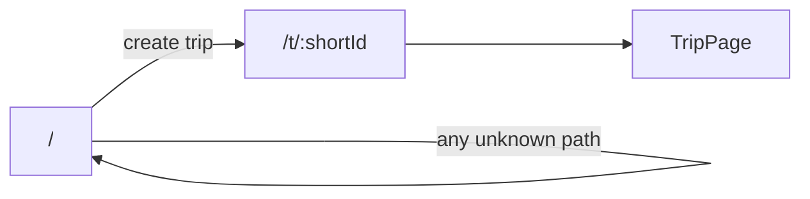
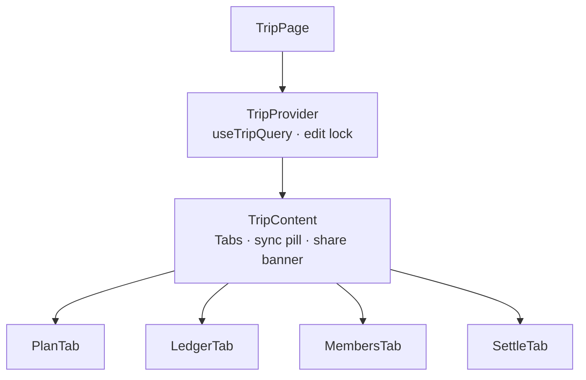
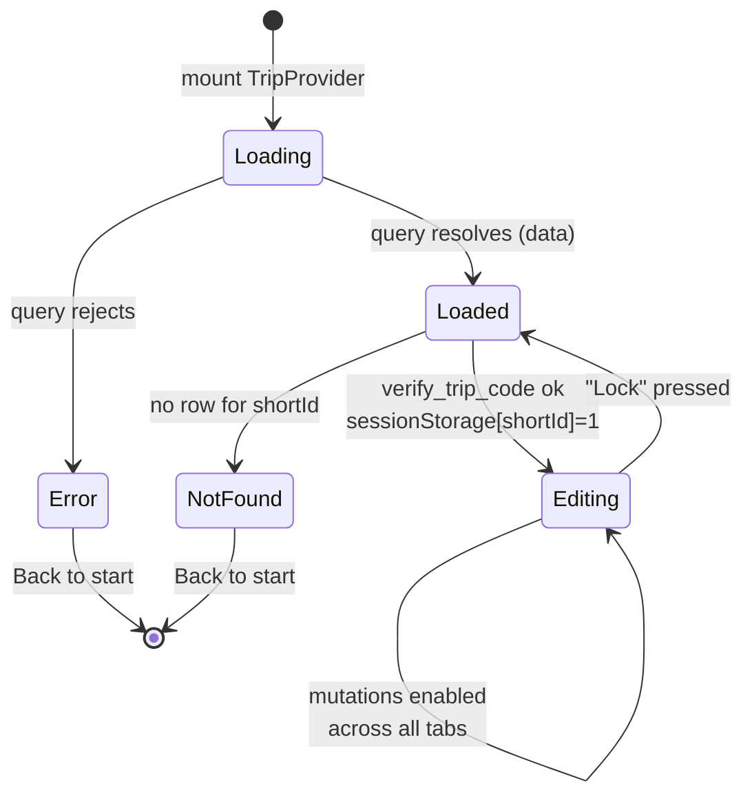
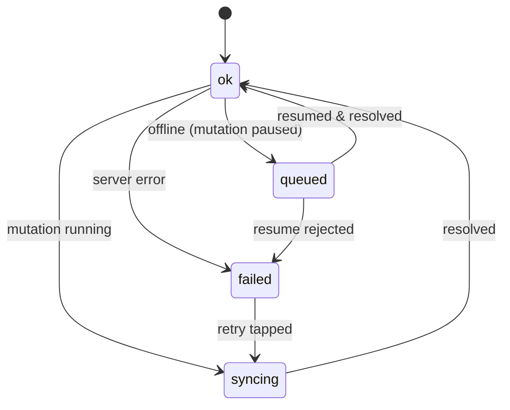
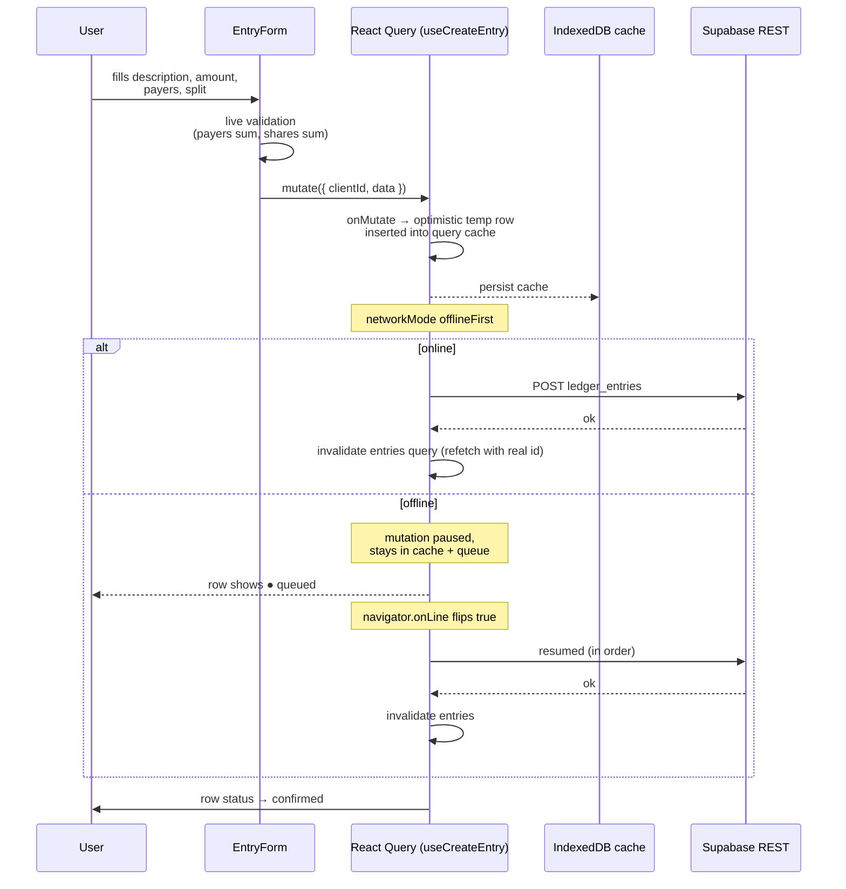
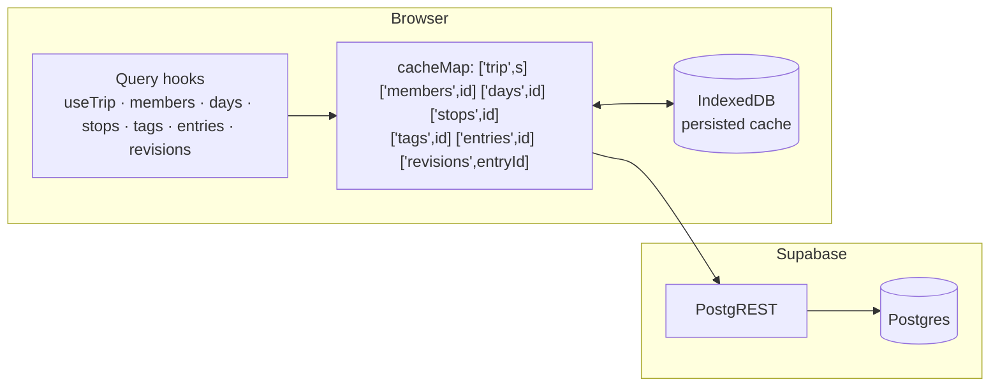
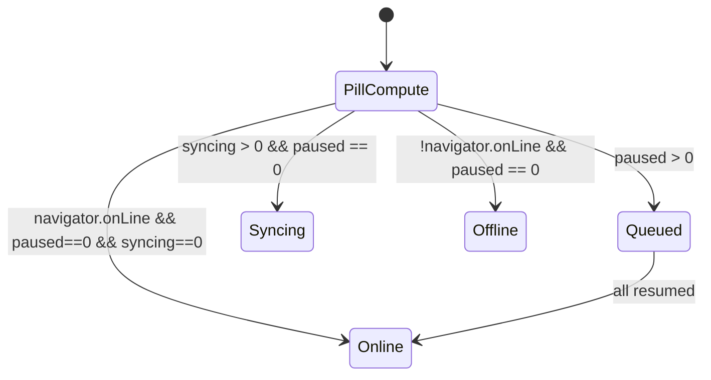

# UI & Data Flow

This document describes the routes, tabs, component tree, optimistic-write pipeline, and the
offline sync flow. All diagrams are [mermaid](https://mermaid.js.org/) and render in any
GitHub-flavoured markdown viewer.

## Routes

- `/` — `Landing.tsx`. Create form: name + 4-digit code → `api.createTrip` → navigate to
  `/t/<shortId>` with `state.justCreated` (shows the share banner) and edit unlocked in
  `sessionStorage`.
- `/t/:shortId` — `TripPage.tsx` wraps content in `TripProvider` (keyed by `shortId` so a
  navigation switches data cleanly). `TripContent` renders the header, nav tabs, and the
  active tab.
- `*` — fallback to Landing.

## Trip access & edit lock

- Edit state is read once from `sessionStorage` (`trailmark:unlocked:<shortId>`).
- `unlock()` calls `verify_trip_code` RPC; wrong code sets `codeError` (inline, visible).

## Per-row sync status

Each ledger row derives its state from the active mutations for that trip via
`useLedgerRowStatus` — it looks up the most recent non-success mutation whose variables
(target a `clientId` or `id`) match the row.

## Ledger entry flow (form → server)

## Data flow overview (reads)

- Queries are keyed by trip id; mutations share the same keys so invalidation refetches fresh
  data.
- `useRevisions(entryId, enabled)` fetches only when the "edited" badge is tapped.
- The service worker's network-first rule for `/rest/v1/*` keeps a stale-but-rendered cache
  fallback when offline.

## Online / pill state

